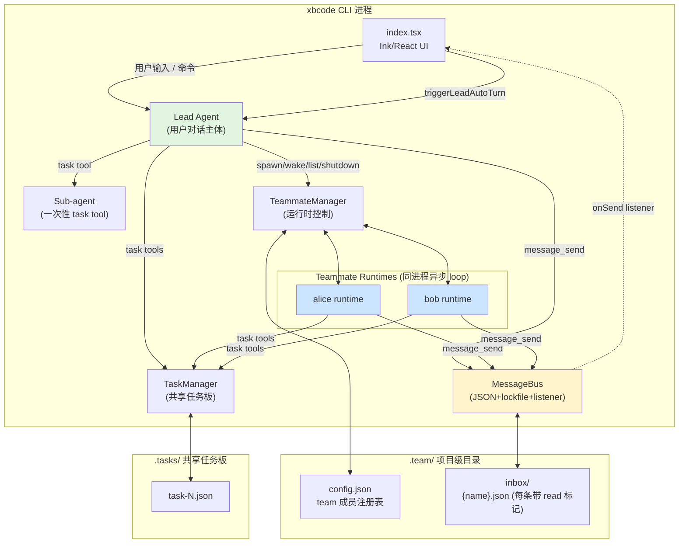
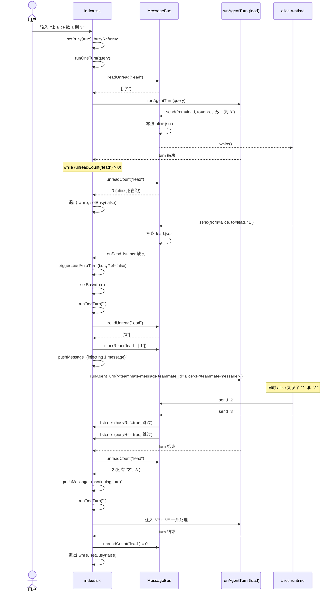
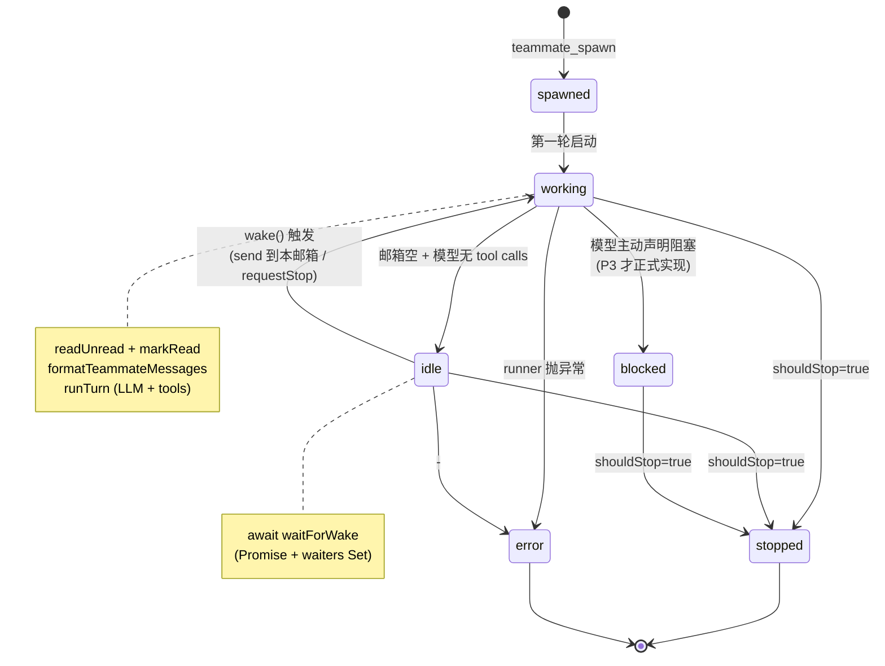
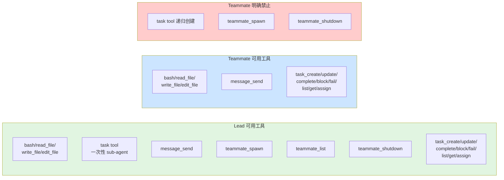

# Team 架构与流程（P1 完成态）

本文记录 P1（邮箱底座升级）完成后 team 系统的全景：组件关系、消息流、生命周期、文件布局、工具权限。

P1 实施细节见 `docs/superpowers/specs/2026-04-30-team-mailbox-overhaul-design.md` 与 `docs/superpowers/plans/2026-04-30-team-mailbox-overhaul.md`。

---

## 一、整体架构图



**关键关系：**

- `MessageBus` 是数据中枢（写入即落盘，listener 立刻通知 UI）
- `TeammateManager` 是控制中枢（拉起/停掉 runtime、状态机维护）
- `MessageBus.onSend("lead")` 是唯一让 lead 被「外部消息」唤醒的渠道（虚线）

---

## 二、Lead 用户主动提交 + 自动续轮流程



**核心机制：**

- **路径 A（主动）**：用户 query 进来后跑 while 直到邮箱空
- **路径 B（被动）**：lead 空闲时 listener 触发 `triggerLeadAutoTurn`
- **互斥**：`busyRef` 防止两条路径并发跑，listener 在 lead 忙时直接 return（while 兜底）

---

## 三、Teammate 生命周期 & 邮件处理流程

### 3.1 状态机



### 3.2 邮件处理时序

```mermaid
sequenceDiagram
    participant Sender as 发送方<br/>(lead / 其他 teammate)
    participant MB as MessageBus
    participant TM as TeammateManager
    participant Loop as alice 的 loop
    participant LLM as runTurn (alice)

    Note over Loop: while (true)
    Loop->>MB: unreadCount("alice")
    MB-->>Loop: 0
    Loop->>TM: markIdle("alice")
    Loop->>TM: waitForWake(control)
    Note over Loop: ⏸ 阻塞等 wake

    Sender->>MB: send(to=alice, content="...")
    MB-->>MB: 写盘 alice.json (read=false)
    MB->>TM: (sendTeamMessage 内调) wake("alice")
    TM->>Loop: resolve waiters
    Note over Loop: ▶️ 醒来

    Loop->>MB: unreadCount > 0
    Loop->>MB: readUnread("alice")
    MB-->>Loop: [msg1, msg2, ...]
    Loop->>MB: markRead("alice", inbox)
    Loop->>TM: markWorking("alice")
    Loop->>LLM: runTurn(formatTeammateMessages(inbox) + workPrompt)
    LLM-->>Loop: tool calls / 完成

    Note over Loop: 处理完回到顶部 while
```

---

## 四、文件布局

```
.team/
├── config.json            # { version: 2, leadName: "lead", members: [...] }
└── inbox/
    ├── lead.json          # MailboxMessage[]，全量保留含 read 标记
    ├── alice.json
    └── bob.json

.tasks/                    # 共享任务板（被 lead/teammates 同读同写）
└── task-N.json
```

`MailboxMessage` 结构（CC 同款）：

```json
{
  "from": "alice",
  "text": "数到 1",
  "timestamp": "2026-04-30T05:30:00.123Z",
  "read": true,
  "color": null,
  "summary": null
}
```

字段语义：

| 字段 | 含义 | 当前用途 |
|---|---|---|
| `from` | 发送方名 | 投递时填，注入时拼到 `<teammate-message teammate_id="...">` |
| `text` | 消息正文 | 注入时作为 tag 内容 |
| `timestamp` | ISO 时间戳 | 与 `from` 组成 markRead 的复合键 |
| `read` | 已读标记 | drain 模式的替代品；保留全量历史用于审计 |
| `color` | UI 颜色 | P1 占位，P4 启用 |
| `summary` | 5-10 词摘要 | P1 占位，P4 启用 |

---

## 五、工具权限分布



**核心隔离原则**：组织管理权（spawn/shutdown）只在 lead；teammate 不能再递归拉新 teammate，避免规模失控。

---

## 六、关键源文件分布

| 文件 | 职责 |
|---|---|
| `src/team-types.ts` | `MailboxMessage / TeamConfig / TeamMemberStatus / TeammateRecord / TeammateRuntimeState` 类型定义 |
| `src/message-bus.ts` | `MessageBus` 类（send/readUnread/markRead/unreadCount/onSend）+ `formatTeammateMessages` |
| `src/teammate-manager.ts` | `TeammateManager` 类（注册/状态机/runtime control/wake/shouldStop） |
| `src/agent.ts` | `runAgentTurn`、`launchTeammateRuntime`（teammate loop）、`sendTeamMessage`（带校验+wake） |
| `src/tools.ts` | 全部工具定义、handler、`messageBus / teammateManager / taskManager` 单例 |
| `src/index.tsx` | UI + `runOneTurn` helper + 自动续轮 while + `onSend("lead")` 注册 + `triggerLeadAutoTurn` |

---

## 七、与 Claude Code 完整版的差距速览

| 维度 | 当前（P1 后） | CC 完整版 | 在哪个 P 解决 |
|---|---|---|---|
| 邮箱格式 | ✅ JSON + read + lockfile | 同 | P1 已做 |
| 自动注入 | ✅ runOneTurn + while + onSend | 同 | P1 已做 |
| 注入 XML tag | ✅ `<teammate-message>` | 同 | P1 已做 |
| 多团队 | ❌ 单 `.team/` | 多 `~/.claude/teams/{name}/` | P2 |
| Team=TaskList 1:1 | ❌ | ✅ | P2 |
| 任务 owner 字段 | ❌ assignee 单字段 | ✅ 任意 agent 改 | P2 |
| 工具命名 | `teammate_spawn / message_send` | `Agent / SendMessage` | P3 |
| 广播 `to:"*"` | ❌ 删了 | ✅ | P3 |
| `shutdown_request` 协议 | ❌ 简化为普通消息 | ✅ 双向协议 | P3 |
| `plan_approval_*` 协议 | ❌ | ✅ | P3 |
| AsyncLocalStorage 隔离 | ❌ | ✅ | P4 |
| 颜色 / summary | ⚠️ 字段占位 | ✅ 真填充 | P4 |
| 自动 idle notification | ❌ | ✅ | P4 |

---

## 八、设计取舍速览

| 决策 | 选择 | 理由 |
|---|---|---|
| 邮箱文件格式 | JSON 数组 + read 标记 | CC 同款，便于审计 / 重读 / 重启恢复 |
| 锁库 | proper-lockfile | CC 同款，cross-platform |
| 旧 jsonl 兼容 | 不保留 | learning project 无线上数据，启动直接删 |
| 自动连续回合 | 严格 CC（无熔断、无用户输入优先） | 北哥要求严格对齐 CC |
| `lead_inbox` 工具 | 删除 | CC 没这个工具；保留会让 lead 学到反习惯 |
| 注入格式 | `<teammate-message>` XML | CC 同款，对话语义优于 JSON |
| MailboxMessage 字段 | 简化到 CC 同款 6 字段 | 扩展字段（taskId/threadId 等）P3 用独立 schema 重做 |
| 路径 | P1 不迁，仍 `.team/` | 避免和 P2 多团队改动耦合 |
| Thread 事件历史 | 删除 `.team/events/` | P3 协议消息阶段用独立机制 |
| 中断时 markRead 状态 | 不回滚 | 避免重启后重复处理；UI 历史可查注入内容 |
| `task_complete/block/fail` 内 send | 删除 | 协议事件雏形，P3 用独立 schema 重做 |
| `task_assign` 内 send | 简化保留 | 真实「lead 通知 assignee」消息，简化为 from/to/content |
| `shutdown_request` 协议邮件 | 删除 | 用 `teammateManager.requestStop` 控制平面替代，P3 重做 |
